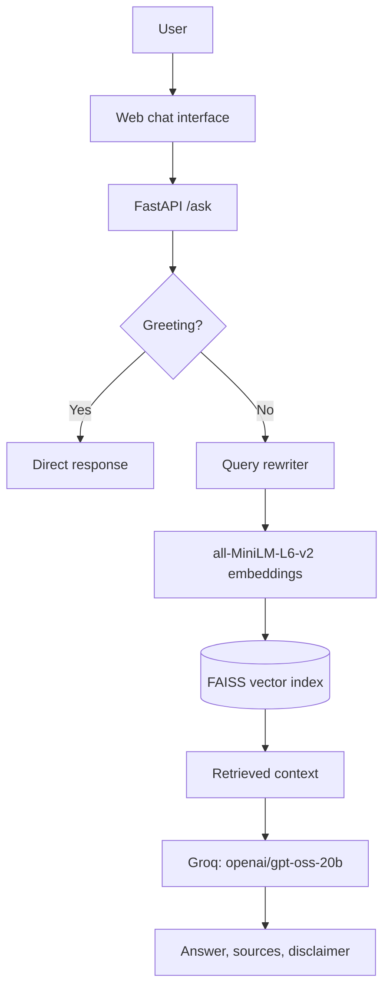

# MediRAG — Medical Question Answering with Retrieval-Augmented Generation

> A retrieval-grounded medical information application built with FastAPI, FAISS, Hugging Face embeddings, and Groq.


## Overview

MediRAG answers medical-information questions using retrieval-augmented generation (RAG). Instead of relying solely on a language model's pretrained knowledge, it searches a local FAISS index built from *The Gale Encyclopedia of Medicine, Second Edition*, then supplies the retrieved passages as context for answer generation.

The application provides:

- Retrieval-grounded answers with page-level sources
- Conversational follow-up support through query rewriting
- Safety-focused generation rules and an educational-use disclaimer
- A FastAPI backend and responsive HTML/CSS/JavaScript chat UI
- Docker-ready deployment for Render

> **Medical disclaimer:** MediRAG is for educational purposes only. It is not a substitute for professional medical advice, diagnosis, or treatment. Do not use it for emergencies or urgent medical decisions.

## Architecture



The core principle is **retrieve first, generate second**.

## RAG pipeline

1. **Load and split documents.** The source PDF is loaded with `pypdf` and split into page-aware chunks.
2. **Embed and index.** Chunks are embedded with `sentence-transformers/all-MiniLM-L6-v2` (384 dimensions, CPU, normalized embeddings) and stored in FAISS.
3. **Understand the question.** Greetings receive a direct response. For follow-ups, conversation history can rewrite an ambiguous question into a better retrieval query.
4. **Retrieve context.** FAISS retrieves `max(k × 3, 10)` candidates; results beyond the distance threshold are excluded, duplicate pages are removed, and up to `k = 3` documents are retained.
5. **Generate a grounded response.** Groq's `openai/gpt-oss-20b` receives the original question and retrieved context. The prompt requires concise, context-only medical information.
6. **Return citations.** The API returns the answer and the source pages used for retrieval.

### Conversational query rewriting

For example, with a previous discussion of diabetes, the question “What about type 2?” can be rewritten to “What about type 2 diabetes?” for retrieval. The original question is still used when generating the final answer.

## Knowledge base

The current index is built from **The Gale Encyclopedia of Medicine, Second Edition**.

- Source document: 759 pages
- Generated chunks: 7,079
- Vector store: `vectorstore/index.faiss` and `vectorstore/index.pkl`

The runtime application requires the vector store, not the original PDF. The Docker image includes the index so it does not have to be rebuilt at startup.

## API

| Endpoint | Purpose |
| --- | --- |
| `GET /` | Serves the chat interface |
| `GET /chat` | Alias for the chat interface |
| `GET /health` | Returns service health |
| `POST /ask` | Answers a medical-information question |
| `GET /docs` | Interactive OpenAPI documentation |

### Health check

```http
GET /health
```

```json
{"status": "healthy"}
```

### Ask a question

```http
POST /ask
Content-Type: application/json
```

```json
{
  "question": "What are the symptoms of anemia?",
  "history": []
}
```

```json
{
  "answer": "Generated medical answer and educational disclaimer...",
  "sources": [
    "The Gale Encyclopedia of Medicine — Page 42"
  ]
}
```

`history` is optional and accepts messages in the form `{"role": "user", "content": "..."}` or `{"role": "assistant", "content": "..."}`.

## Local setup

### Prerequisites

- Python 3.11
- A [Groq API key](https://console.groq.com/keys)
- The source PDF only if rebuilding the FAISS index

### Install

```bash
git clone <your-repository-url>
cd MediRAG

python -m venv .venv
# macOS/Linux
source .venv/bin/activate
# Windows PowerShell
# .venv\Scripts\Activate.ps1

pip install -r requirements.txt
```

Create a `.env` file in the project root:

```env
GROQ_API_KEY=your_groq_api_key
```

Never commit this file.

### Build the index (optional)

Place `The_GALE_ENCYCLOPEDIA_of_MEDICINE_SECOND.pdf` in `data/raw/`, then run:

```bash
python -m app.vectorstore.build_index
```

This creates `vectorstore/index.faiss` and `vectorstore/index.pkl`.

### Run locally

```bash
uvicorn app.api.main:app --reload
```

Open <http://127.0.0.1:8000/>. API documentation is at <http://127.0.0.1:8000/docs>.

## Docker and Render deployment

Build the image:

```bash
docker build -t meditrag .
```

Run it locally with the configured API key:

```bash
docker run --env-file .env -p 10000:10000 meditrag
```

Open <http://localhost:10000/>.

The Docker image uses CPU-only PyTorch and starts Uvicorn on Render's `PORT` environment variable, defaulting to `10000` locally:

```dockerfile
CMD ["sh", "-c", "uvicorn app.api.main:app --host 0.0.0.0 --port ${PORT:-10000}"]
```

For Render, deploy with the included Dockerfile and set `GROQ_API_KEY` as a secret environment variable.

## Testing

Run the test suite with:

```bash
pytest
```

Tests cover ingestion, retrieval, query rewriting, API behavior, pipeline behavior, and evaluation cases.

## Project structure

```text
MediRAG/
├── app/
│   ├── api/main.py              # FastAPI application
│   ├── embeddings/embedder.py   # Embedding model configuration
│   ├── frontend/                # HTML, CSS, and JavaScript chat UI
│   ├── ingestion/               # PDF loading and text chunking
│   ├── llm/groq.py              # Groq client and prompt
│   ├── rag/                     # Intent, rewriting, and RAG pipeline
│   └── vectorstore/             # FAISS index construction
├── data/raw/                    # Source PDF when rebuilding the index
├── evaluation/                  # Evaluation cases
├── tests/                       # Automated tests
├── vectorstore/                 # FAISS index files
├── Dockerfile
└── requirements.txt
```

## Limitations

- The knowledge base is limited to the indexed source material.
- Retrieval quality depends on document chunking and embedding quality.
- Generated output can be incomplete or incorrect despite grounding safeguards.
- This project does not diagnose, prescribe, or replace a qualified healthcare professional.

## Future improvements

- Hybrid keyword and semantic retrieval
- Reranking and retrieval-quality metrics
- Additional authoritative medical sources
- Improved citation handling and observability
- Streaming responses, conversation persistence, authentication, and rate limiting

## Author

**Rounak Kumar** — Data Science, Machine Learning, RAG, NLP, and Generative AI<br>
Portfolio: <https://www.heyrounak.me/>
